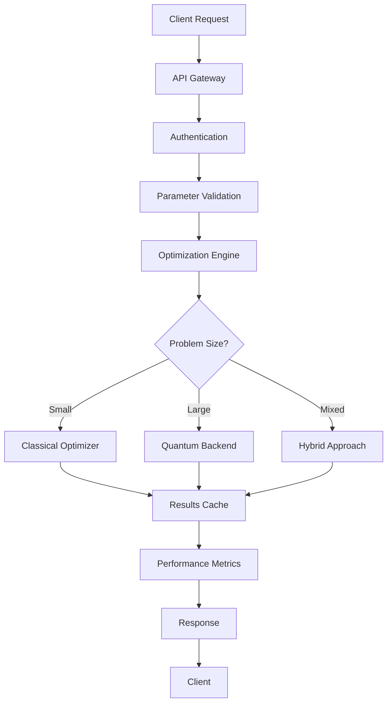

# Architecture Documentation

## System Overview

The Quantum Hyperparameter Search framework is an enterprise-grade quantum-classical hybrid optimization system designed for production machine learning workloads.

## High-Level Architecture

```
┌─────────────────────────────────────────────────────────────────┐
│                    API Gateway & Load Balancer                  │
├─────────────────────────────────────────────────────────────────┤
│                    Authentication & Authorization                │
├─────────────────────────────────────────────────────────────────┤
│  ┌─────────────────┐  ┌─────────────────┐  ┌─────────────────┐ │
│  │  Optimization   │  │   Monitoring    │  │    Security     │ │
│  │    Engine       │  │   & Metrics     │  │   & Compliance  │ │
│  └─────────────────┘  └─────────────────┘  └─────────────────┘ │
├─────────────────────────────────────────────────────────────────┤
│  ┌─────────────────┐  ┌─────────────────┐  ┌─────────────────┐ │
│  │ Quantum Backend │  │ Classical ML    │  │  Caching &      │ │
│  │   Interface     │  │   Pipelines     │  │  Storage        │ │
│  └─────────────────┘  └─────────────────┘  └─────────────────┘ │
├─────────────────────────────────────────────────────────────────┤
│                    Infrastructure Layer                         │
│  ┌─────────────────┐  ┌─────────────────┐  ┌─────────────────┐ │
│  │   Kubernetes    │  │     Docker      │  │   Terraform     │ │
│  │   Orchestration │  │ Containerization│  │ Infrastructure  │ │
│  └─────────────────┘  └─────────────────┘  └─────────────────┘ │
└─────────────────────────────────────────────────────────────────┘
```

## Component Architecture

### Core Components

#### 1. Quantum Optimization Engine
- **Location**: `quantum_hyper_search/core/`
- **Purpose**: Main optimization logic with quantum-classical hybrid algorithms
- **Key Files**:
  - `quantum_hyper_search.py` - Primary optimization engine
  - `qubo_encoder.py` - QUBO problem formulation
  - `optimization_history.py` - Results tracking

#### 2. Backend Abstraction Layer
- **Location**: `quantum_hyper_search/backends/`
- **Purpose**: Unified interface for quantum and classical backends
- **Key Files**:
  - `backend_factory.py` - Dynamic backend selection
  - `simulator_backend.py` - Classical simulation
  - `dwave_backend.py` - D-Wave integration

#### 3. Multi-Scale Optimization
- **Location**: `quantum_hyper_search/optimization/`
- **Purpose**: Enterprise-grade scaling and performance optimization
- **Key Files**:
  - `multi_scale_optimizer.py` - Adaptive scaling framework
  - `parallel_optimization.py` - Distributed execution
  - `performance_accelerator.py` - Performance optimization

#### 4. Research & Advanced Algorithms
- **Location**: `quantum_hyper_search/research/`
- **Purpose**: Novel quantum algorithms and experimental features
- **Key Files**:
  - `quantum_advantage_accelerator.py` - Quantum advantage algorithms
  - `quantum_parallel_tempering.py` - Advanced annealing techniques
  - `quantum_machine_learning_bridge.py` - ML integration

## Data Flow Architecture



## Security Architecture

### Authentication & Authorization
- JWT-based authentication
- Role-based access control (RBAC)
- Enterprise SSO integration
- API key management

### Data Protection
- Quantum-safe encryption (CRYSTALS-Kyber)
- End-to-end encryption for sensitive data
- Data residency compliance
- Audit logging for all operations

### Network Security
- TLS 1.3 for all communications
- API rate limiting
- DDoS protection
- Network segmentation

## Deployment Architecture

### Production Deployment
```
┌─────────────────────────────────────────────────────────────┐
│                     Load Balancer                          │
├─────────────────────────────────────────────────────────────┤
│  ┌─────────────┐  ┌─────────────┐  ┌─────────────┐        │
│  │    Pod 1    │  │    Pod 2    │  │    Pod 3    │        │
│  │   (Active)  │  │   (Active)  │  │  (Standby)  │        │
│  └─────────────┘  └─────────────┘  └─────────────┘        │
├─────────────────────────────────────────────────────────────┤
│                    Service Mesh                            │
├─────────────────────────────────────────────────────────────┤
│  ┌─────────────┐  ┌─────────────┐  ┌─────────────┐        │
│  │   Redis     │  │ PostgreSQL  │  │ Prometheus  │        │
│  │   Cache     │  │  Database   │  │ Monitoring  │        │
│  └─────────────┘  └─────────────┘  └─────────────┘        │
└─────────────────────────────────────────────────────────────┘
```

### Scaling Strategy
- Horizontal pod autoscaling based on CPU/memory usage
- Custom metrics scaling for optimization queue depth
- Regional deployment for disaster recovery
- Blue-green deployment for zero-downtime updates

## Performance Characteristics

### Optimization Performance
- **Target Response Time**: <200ms for API calls
- **Throughput**: 1000+ concurrent optimizations
- **Quantum Advantage Threshold**: Problems >100 parameters
- **Cache Hit Rate**: >85% for repeated optimizations

### Resource Utilization
- **Memory**: 2-8GB per optimization pod
- **CPU**: 1-4 cores per pod with burst capability
- **Storage**: 100GB persistent storage for cache
- **Network**: 1Gbps bandwidth for quantum backend communication

## Monitoring & Observability

### Metrics Collection
- Application metrics via Prometheus
- Custom quantum-specific metrics
- Business metrics (optimization success rates)
- Infrastructure metrics (resource utilization)

### Logging Strategy
- Structured logging in JSON format
- Centralized log aggregation
- Log retention: 90 days for audit, 30 days for debug
- Real-time log analysis for security events

### Alerting
- SLA-based alerting (uptime, response time)
- Security event notifications
- Resource exhaustion warnings
- Optimization failure detection

## Technology Stack

### Core Technologies
- **Language**: Python 3.8+
- **Framework**: FastAPI for API layer
- **Quantum**: Qiskit, D-Wave Ocean SDK
- **ML**: scikit-learn, TensorFlow, PyTorch

### Infrastructure
- **Orchestration**: Kubernetes
- **Containerization**: Docker
- **Service Mesh**: Istio
- **Infrastructure as Code**: Terraform

### Data & Storage
- **Cache**: Redis Cluster
- **Database**: PostgreSQL for metadata
- **Time Series**: InfluxDB for metrics
- **Object Storage**: S3-compatible storage

### Monitoring & Security
- **Monitoring**: Prometheus + Grafana
- **Logging**: ELK Stack (Elasticsearch, Logstash, Kibana)
- **Security**: HashiCorp Vault for secrets
- **Compliance**: Open Policy Agent (OPA)

## Design Principles

### 1. Quantum-Classical Hybrid
- Seamless integration between quantum and classical algorithms
- Automatic algorithm selection based on problem characteristics
- Fallback mechanisms for quantum hardware unavailability

### 2. Enterprise-First Design
- Security and compliance built-in from the ground up
- Multi-tenancy support with resource isolation
- Comprehensive audit trails and monitoring

### 3. Performance Optimization
- Intelligent caching strategies
- Parallel execution capabilities
- Resource-aware scheduling
- Predictive scaling based on workload patterns

### 4. Extensibility
- Plugin architecture for new optimization algorithms
- Backend abstraction for different quantum providers
- API versioning for backward compatibility
- Modular component design

## Future Architecture Considerations

### Quantum Hardware Evolution
- Support for emerging quantum hardware platforms
- Quantum error correction integration
- Hybrid classical-quantum algorithms advancement

### Scalability Improvements
- Multi-region deployment capabilities
- Edge computing integration for latency reduction
- Advanced caching strategies with machine learning

### AI/ML Integration
- AutoML capabilities for automatic algorithm selection
- Reinforcement learning for optimization strategy selection
- Federated learning support for multi-tenant scenarios